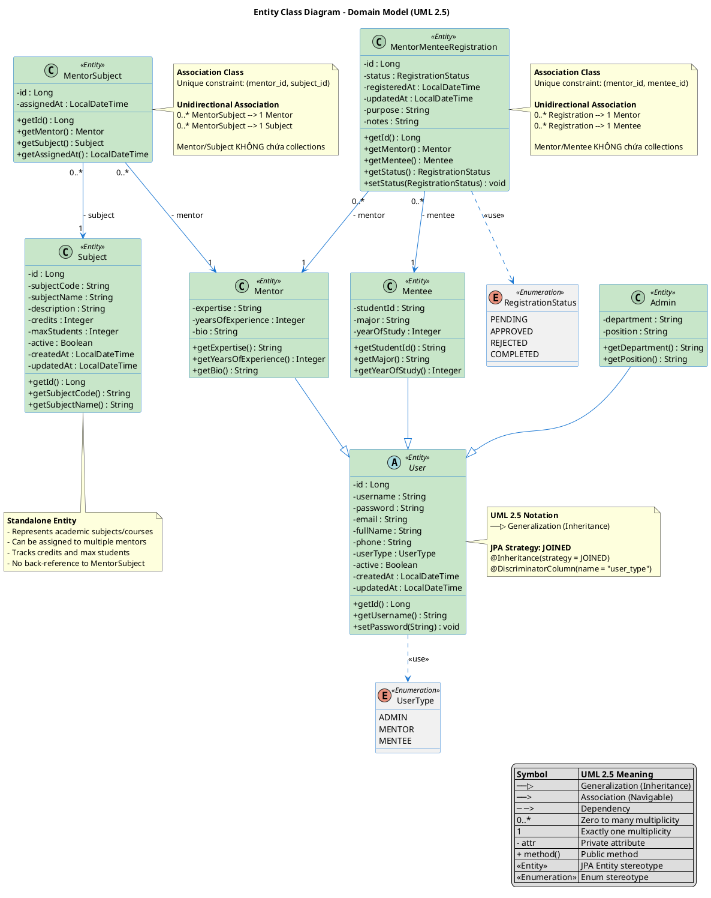

# Entity Class Diagram

## Mô tả

Sơ đồ này thể hiện cấu trúc tĩnh của các **Entity classes** trong hệ thống, bao gồm:
- Các attributes (thuộc tính) của mỗi entity
- Relationships (quan hệ) giữa các entities
- Inheritance hierarchy (kế thừa)
- Enumerations (enum)

Sơ đồ này tập trung **chỉ vào domain model** (các thực thể nghiệp vụ), không bao gồm DTOs, Controllers, Services, hoặc các lớp khác.

## Ký hiệu UML 2.5 - Class Diagram

| Ký hiệu | Ý nghĩa | Mô tả |
|---------|---------|-------|
| `──▷` (hollow triangle) | Generalization | Quan hệ kế thừa (extends) |
| `──>` (solid arrow) | Association | Liên kết có hướng navigable |
| `─ ─>` (dashed arrow) | Dependency | Phụ thuộc (uses) |
| `- attribute` | Private | Visibility private |
| `+ method()` | Public | Visibility public |
| `0..*` | Multiplicity | Zero to many |
| `1` | Multiplicity | Exactly one |
| `<<stereotype>>` | Stereotype | Phân loại (Entity, Enum) |

## Diagram



## Mô tả chi tiết các Entity

### 1. User (Abstract Base Class)

**Mục đích**: Lớp cơ sở trừu tượng cho tất cả các loại người dùng trong hệ thống.

**Đặc điểm**:
- Sử dụng **JOINED inheritance strategy**: mỗi subclass có bảng riêng, chia sẻ bảng `users` chung
- Discriminator column: `user_type` để phân biệt loại user
- Chứa thông tin chung: username, password, email, fullName, phone
- Quản lý trạng thái: `active` (boolean)
- Tự động tracking: `createdAt`, `updatedAt` (Hibernate timestamps)

**Constraints**:
- `username`: unique, not null
- `password`, `email`, `fullName`, `phone`: not null
- `active`: not null, default = true

### 2. Admin

**Mục đích**: Đại diện cho người quản trị hệ thống.

**Thuộc tính bổ sung**:
- `department`: Phòng ban
- `position`: Chức vụ

**Kế thừa từ**: `User` với discriminator value = "ADMIN"

### 3. Mentor

**Mục đích**: Đại diện cho người hướng dẫn (mentor).

**Thuộc tính bổ sung**:
- `expertise`: Chuyên môn
- `yearsOfExperience`: Số năm kinh nghiệm
- `bio`: Tiểu sử

**Quan hệ**: Không chứa collections. Quan hệ được quản lý thông qua `MentorSubject` và `MentorMenteeRegistration`.

**Kế thừa từ**: `User` với discriminator value = "MENTOR"

### 4. Mentee

**Mục đích**: Đại diện cho học viên (mentee).

**Thuộc tính bổ sung**:
- `studentId`: Mã sinh viên
- `major`: Chuyên ngành
- `yearOfStudy`: Năm học

**Quan hệ**: Không chứa collections. Quan hệ được quản lý thông qua `MentorMenteeRegistration`.

**Kế thừa từ**: `User` với discriminator value = "MENTEE"

### 5. Subject

**Mục đích**: Đại diện cho môn học trong hệ thống.

**Thuộc tính**:
- `id`: Primary key
- `subjectCode`: Mã môn học (unique, not null)
- `subjectName`: Tên môn học (not null)
- `description`: Mô tả môn học
- `credits`: Số tín chỉ (not null)
- `maxStudents`: Số lượng sinh viên tối đa (not null)
- `active`: Trạng thái hoạt động (not null, default = true)
- `createdAt`, `updatedAt`: Timestamps

**Quan hệ**: Không chứa collections. Quan hệ được quản lý thông qua `MentorSubject`.

### 6. MentorSubject (Join Entity)

**Mục đích**: Join table để thể hiện quan hệ many-to-many giữa `Mentor` và `Subject`.

**Thuộc tính**:
- `id`: Primary key
- `assignedAt`: Thời điểm assign môn học cho mentor (not null, updatable: false)

**Quan hệ**:
- **Many-to-One** với `Mentor`: Nhiều MentorSubject thuộc về một Mentor
- **Many-to-One** với `Subject`: Nhiều MentorSubject thuộc về một Subject

**Constraints**:
- Unique constraint: `(mentor_id, subject_id)` - một mentor không thể được assign cùng một môn học hai lần

**Bảng database**: `mentor_subjects`

### 7. MentorMenteeRegistration (Join Entity)

**Mục đích**: Join table để thể hiện quan hệ many-to-many giữa `Mentor` và `Mentee`, lưu trữ thông tin đăng ký.

**Thuộc tính**:
- `id`: Primary key
- `status`: Trạng thái đăng ký (not null, default: PENDING)
- `registeredAt`: Thời điểm đăng ký (not null, updatable: false)
- `updatedAt`: Thời điểm cập nhật cuối (not null)
- `purpose`: Mục đích đăng ký (optional)
- `notes`: Ghi chú (optional)

**Quan hệ**:
- **Many-to-One** với `Mentor`: Nhiều đăng ký thuộc về một Mentor
- **Many-to-One** với `Mentee`: Nhiều đăng ký thuộc về một Mentee
- **Many-to-One** với `RegistrationStatus`: Mỗi đăng ký có một trạng thái

**Constraints**:
- Unique constraint: `(mentor_id, mentee_id)` - một mentee không thể đăng ký với cùng một mentor hai lần

**Bảng database**: `mentor_mentee_registrations`

### 8. UserType (Enumeration)

**Giá trị**:
- `ADMIN`: Người quản trị
- `MENTOR`: Người hướng dẫn
- `MENTEE`: Học viên

**Sử dụng**: Discriminator cho `User` inheritance hierarchy

### 9. RegistrationStatus (Enumeration)

**Giá trị**:
- `PENDING`: Đang chờ xử lý
- `APPROVED`: Đã được phê duyệt
- `REJECTED`: Đã bị từ chối
- `COMPLETED`: Đã hoàn thành

**Sử dụng**: Trạng thái của `MentorMenteeRegistration`

## Relationships Summary

### 1. Inheritance (Generalization) - Kế thừa

**Ký hiệu**: Mũi tên tam giác rỗng (`<|--`)

```
User (abstract)
├── Admin
├── Mentor
└── Mentee
```

- `Admin`, `Mentor`, `Mentee` kế thừa từ `User`
- Sử dụng JOINED inheritance strategy trong JPA
- Mỗi subclass có bảng riêng, chia sẻ bảng `users` chung

### 2. Unidirectional Association - Quan hệ một chiều

**Ký hiệu**: Mũi tên (`-->`)

**Đặc điểm**:
- Chỉ entity con (join entity) chứa reference đến entity cha
- Entity cha **KHÔNG chứa collection** của entity con
- Truy vấn thông qua Repository của entity con

**Các quan hệ Unidirectional trong hệ thống**:

1. **MentorSubject --> Mentor** (* to 1)
   - `MentorSubject` chứa reference đến `Mentor`
   - `Mentor` **KHÔNG chứa** `Set<MentorSubject>`
   - Truy vấn: `MentorSubjectRepository.findByMentorId()`

2. **MentorSubject --> Subject** (* to 1)
   - `MentorSubject` chứa reference đến `Subject`
   - `Subject` **KHÔNG chứa** `Set<MentorSubject>`
   - Truy vấn: `MentorSubjectRepository.findBySubjectId()`

3. **MentorMenteeRegistration --> Mentor** (* to 1)
   - `MentorMenteeRegistration` chứa reference đến `Mentor`
   - `Mentor` **KHÔNG chứa** `Set<MentorMenteeRegistration>`
   - Truy vấn: `MentorMenteeRegistrationRepository.findByMentorId()`

4. **MentorMenteeRegistration --> Mentee** (* to 1)
   - `MentorMenteeRegistration` chứa reference đến `Mentee`
   - `Mentee` **KHÔNG chứa** `Set<MentorMenteeRegistration>`
   - Truy vấn: `MentorMenteeRegistrationRepository.findByMenteeId()`

### 3. Dependency - Quan hệ phụ thuộc

**Ký hiệu**: Mũi tên nét đứt (`..>`)

**Các quan hệ Dependency**:

1. **User ..> UserType**
   - `User` sử dụng enum `UserType`
   - Dependency vì `User` phụ thuộc vào định nghĩa của `UserType`

2. **MentorMenteeRegistration ..> RegistrationStatus**
   - `MentorMenteeRegistration` sử dụng enum `RegistrationStatus`
   - Dependency vì `MentorMenteeRegistration` phụ thuộc vào định nghĩa của `RegistrationStatus`

### Tổng kết các quan hệ Many-to-Many

1. **Mentor ↔ Subject** (Many-to-Many)
   - Thông qua: `MentorSubject` (join entity)
   - Một mentor có thể dạy nhiều môn học
   - Một môn học có thể được dạy bởi nhiều mentors
   - **Unidirectional**: 
     - `MentorSubject` chứa references đến `Mentor` và `Subject`
     - `Mentor` và `Subject` **KHÔNG chứa** collections
     - Truy vấn qua `MentorSubjectRepository`

2. **Mentor ↔ Mentee** (Many-to-Many)
   - Thông qua: `MentorMenteeRegistration` (join entity)
   - Một mentor có thể có nhiều mentees đăng ký
   - Một mentee có thể đăng ký với nhiều mentors
   - **Unidirectional**: 
     - `MentorMenteeRegistration` chứa references đến `Mentor` và `Mentee`
     - `Mentor` và `Mentee` **KHÔNG chứa** collections
     - Truy vấn qua `MentorMenteeRegistrationRepository`

## Database Schema Mapping

### Tables

1. **users** (base table)
   - Chứa thông tin chung của tất cả users
   - Discriminator: `user_type`

2. **admins** (child table)
   - Foreign key: `id` → `users.id`
   - Chứa: `department`, `position`

3. **mentors** (child table)
   - Foreign key: `id` → `users.id`
   - Chứa: `expertise`, `yearsOfExperience`, `bio`

4. **mentees** (child table)
   - Foreign key: `id` → `users.id`
   - Chứa: `studentId`, `major`, `yearOfStudy`

5. **subjects**
   - Standalone table
   - Primary key: `id`

6. **mentor_subjects** (join table)
   - Foreign keys: `mentor_id` → `mentors.id`, `subject_id` → `subjects.id`
   - Unique constraint: `(mentor_id, subject_id)`

7. **mentor_mentee_registrations** (join table)
   - Foreign keys: `mentor_id` → `mentors.id`, `mentee_id` → `mentees.id`
   - Unique constraint: `(mentor_id, mentee_id)`

## JPA Annotations Summary

### Inheritance
- `@Inheritance(strategy = InheritanceType.JOINED)`: JOINED table strategy
- `@DiscriminatorColumn`: Column để phân biệt loại user
- `@DiscriminatorValue`: Giá trị discriminator cho mỗi subclass

### Relationships (Unidirectional)
- `@ManyToOne`: Many-to-One relationship (chỉ có ở join entities)
- `@JoinColumn`: Foreign key column name
- **Không sử dụng** `@OneToMany` trong `Mentor`, `Subject`, `Mentee`

### Constraints
- `@UniqueConstraint`: Unique constraint trên nhiều columns
- `@Column(nullable = false)`: Not null constraint
- `@Column(unique = true)`: Unique constraint

### Timestamps
- `@CreationTimestamp`: Tự động set khi tạo
- `@UpdateTimestamp`: Tự động update khi modify
