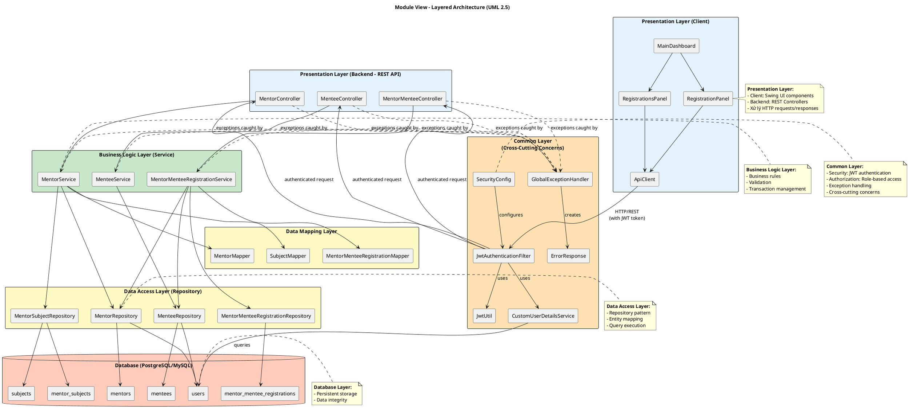

```plantuml
@startuml Sequence_Register_Mentor
title Sequence Diagram: Đăng ký Mentor cho Mentee (UML 2.5)

' Định nghĩa Lifelines
actor "Mentee" as User
participant "RegistrationPanel" as RP
participant "ApiClient" as AC
participant "JwtAuthenticationFilter" as JWTFilter
participant "JwtUtil" as JWT
participant "CustomUserDetailsService" as UserDetails
participant "SecurityConfig" as Security
participant "MentorController" as MC
participant "MentorService" as MS
participant "MentorRepository" as MR
participant "MentorSubjectRepository" as MSR
database "Database" as DB
participant "MentorMenteeController" as MMC
participant "MentorMenteeRegistrationService" as MMRS
participant "MentorMenteeRegistrationRepository" as MMRR
participant "MenteeRepository" as MeR
participant "MentorMapper" as MapM
participant "SubjectMapper" as MapS
participant "MentorMenteeRegistrationMapper" as MapMMR
participant "GlobalExceptionHandler" as ExceptionHandler

== Load Available Mentors ==
User -> RP: Click "Register with Mentor" tab
activate RP
RP -> RP: initializeUI()
RP -> RP: loadMentors()
activate RP
RP -> AC: getAllMentors(currentUserId)
activate AC
AC -> AC: Build HTTP request\nAdd Authorization: Bearer {token}
AC -> JWTFilter: HTTP Request\nGET /api/mentors?menteeId={id}\nAuthorization: Bearer {token}

== JWT Authentication ==
activate JWTFilter
JWTFilter -> JWTFilter: Extract token from\nAuthorization header
alt No Authorization header or invalid format
    JWTFilter -> AC: Continue without authentication
    AC --> RP: HTTP 401 Unauthorized
    RP --> User: Show error message
else Valid Authorization header
    JWTFilter -> JWT: extractUsername(token)
    activate JWT
    JWT -> JWT: Parse JWT token\nExtract claims
    JWT --> JWTFilter: username
    deactivate JWT
    
    JWTFilter -> UserDetails: loadUserByUsername(username)
    activate UserDetails
    UserDetails -> DB: SELECT * FROM users WHERE username = ?
    activate DB
    DB --> UserDetails: User entity
    deactivate DB
    UserDetails -> UserDetails: Create UserDetails with\nROLE_{userType} authority
    UserDetails --> JWTFilter: UserDetails with authorities
    deactivate UserDetails
    
    JWTFilter -> JWT: validateToken(token, userDetails)
    activate JWT
    JWT -> JWT: Check token signature\nCheck expiration
    alt Token invalid or expired
        JWT --> JWTFilter: false
        JWTFilter -> ExceptionHandler: AccessDeniedException
        activate ExceptionHandler
        ExceptionHandler -> ExceptionHandler: Create ErrorResponse\nHTTP 401 Unauthorized
        ExceptionHandler --> AC: HTTP 401 Unauthorized\nErrorResponse
        deactivate ExceptionHandler
        AC --> RP: IOException
        RP --> User: Show error: "Unauthorized"
    else Token valid
        JWT --> JWTFilter: true
        JWTFilter -> JWTFilter: Create UsernamePasswordAuthenticationToken\nwith UserDetails and authorities
        JWTFilter -> JWTFilter: Set authentication in\nSecurityContextHolder
        JWTFilter -> MC: Continue to controller
    end
    deactivate JWT
end

== Role-Based Authorization Check ==
MC -> Security: @PreAuthorize("isAuthenticated()")
activate Security
Security -> Security: Check SecurityContext\nfor authentication
Security -> Security: Verify user is authenticated
alt User not authenticated
    Security -> ExceptionHandler: AccessDeniedException
    activate ExceptionHandler
    ExceptionHandler --> MC: HTTP 403 Forbidden
    deactivate ExceptionHandler
    MC --> AC: HTTP 403 Forbidden
    AC --> RP: IOException
    RP --> User: Show error: "Access Denied"
else User authenticated
    Security --> MC: Authorization granted
    deactivate Security
    MC -> MS: getAllMentors(menteeId)
activate MS
MS -> MR: findAllActiveExcludingMentee(menteeId)
activate MR
MR -> DB: SELECT m.*\nFROM mentors m\nWHERE m.active = true\nAND m.id NOT IN (SELECT mentor_id FROM mentor_mentee_registrations WHERE mentee_id = ?)
activate DB
DB --> MR: List<Mentor>
deactivate DB
MR --> MS: List<Mentor>
deactivate MR

loop For each mentor
    MS -> MSR: findByMentorIdWithSubject(mentorId)
    activate MSR
    MSR -> DB: SELECT ms.*, s.*\nFROM mentor_subjects ms\nJOIN subjects s ON ms.subject_id = s.id\nWHERE ms.mentor_id = ?
    activate DB
    DB --> MSR: List<MentorSubject> with subjects
    deactivate DB
    MSR --> MS: List<MentorSubject>
    deactivate MSR
    MS -> MapM: toDTO(mentor)
    activate MapM
    MapM --> MS: MentorDTO
    deactivate MapM
    MS -> MapS: toDTO(subject) for each subject
    activate MapS
    MapS --> MS: SubjectDTO
    deactivate MapS
end

MS --> MC: List<MentorDTO>
deactivate MS
MC --> AC: ResponseEntity<List<MentorDTO>>
deactivate MC
AC --> RP: List<MentorDTO>
deactivate AC
RP -> RP: Display mentors in table
RP --> User: Show mentor list with subjects
deactivate RP

== Select Mentor and Register ==
User -> RP: Select mentor from table\nClick "Đăng Ký" button
activate RP
RP -> RP: handleRegistration()
RP -> RP: showConfirmationDialog(mentor)
RP --> User: Show confirmation dialog\nwith mentor info
User -> RP: Click "Xác Nhận Đăng Ký"
RP -> RP: submitRegistration(mentorId, null)
activate RP
RP -> AC: createRegistration(dto)
activate AC
note right of AC
  dto = {
    mentorId: Long,
    menteeId: Long,
    purpose: ""
  }
end note
AC -> AC: Build HTTP POST request\nAdd Authorization: Bearer {token}
AC -> JWTFilter: HTTP Request\nPOST /api/registrations\nAuthorization: Bearer {token}

== JWT Authentication (Register) ==
activate JWTFilter
JWTFilter -> JWTFilter: Extract and validate token
JWTFilter -> JWT: extractUsername(token)
activate JWT
JWT --> JWTFilter: username
deactivate JWT
JWTFilter -> UserDetails: loadUserByUsername(username)
activate UserDetails
UserDetails -> DB: SELECT * FROM users WHERE username = ?
activate DB
DB --> UserDetails: User entity
deactivate DB
UserDetails --> JWTFilter: UserDetails with ROLE_MENTEE
deactivate UserDetails
JWTFilter -> JWT: validateToken(token, userDetails)
activate JWT
JWT --> JWTFilter: true (valid)
deactivate JWT
JWTFilter -> JWTFilter: Set authentication in SecurityContext
JWTFilter -> MMC: Continue to controller
deactivate JWTFilter

== Role-Based Authorization Check (Register) ==
MMC -> Security: @PreAuthorize("hasRole('MENTEE')")
activate Security
Security -> Security: Check SecurityContext\nGet user authorities
Security -> Security: Verify has ROLE_MENTEE
alt User does not have MENTEE role
    Security -> ExceptionHandler: AccessDeniedException
    activate ExceptionHandler
    ExceptionHandler -> ExceptionHandler: Create ErrorResponse\nHTTP 403 Forbidden
    ExceptionHandler --> MMC: HTTP 403 Forbidden\nErrorResponse
    deactivate ExceptionHandler
    MMC --> AC: HTTP 403 Forbidden
    AC --> RP: IOException("Access Denied")
    RP --> User: Show error: "Access Denied"
else User has MENTEE role
    Security --> MMC: Authorization granted
    deactivate Security
    
    == Input Validation ==
    MMC -> MMC: @Valid annotation\nValidates MentorMenteeRegistrationDTO
    alt Validation fails
        MMC -> ExceptionHandler: MethodArgumentNotValidException
        activate ExceptionHandler
        ExceptionHandler -> ExceptionHandler: Extract field errors\nCreate ErrorResponse with validationErrors
        ExceptionHandler --> MMC: HTTP 400 Bad Request\nErrorResponse
        deactivate ExceptionHandler
        MMC --> AC: HTTP 400 Bad Request
        AC --> RP: IOException
        RP --> User: Show validation errors
    else Validation passes
        MMC -> MMRS: registerMentorMentee(dto)
        activate MMRS
        
        == Business Validation ==
        MMRS -> MMRR: existsByMentorIdAndMenteeId(mentorId, menteeId)
        activate MMRR
        MMRR -> DB: SELECT COUNT(*) FROM mentor_mentee_registrations\nWHERE mentor_id = ? AND mentee_id = ?
        activate DB
        DB --> MMRR: Boolean
        deactivate DB
        MMRR --> MMRS: Boolean result
        deactivate MMRR
        
        alt Duplicate Registration
            MMRS -> MMRS: throw new DuplicateResourceException\n("You have already registered with this mentor")
            MMRS -> ExceptionHandler: DuplicateResourceException
            activate ExceptionHandler
            ExceptionHandler -> ExceptionHandler: Create ErrorResponse\nHTTP 409 Conflict
            ExceptionHandler --> MMRS: Exception propagated
            deactivate ExceptionHandler
            MMRS --> MMC: throw DuplicateResourceException
            MMC -> ExceptionHandler: Catch DuplicateResourceException
            activate ExceptionHandler
            ExceptionHandler -> ExceptionHandler: handleDuplicateResourceException()\nCreate ErrorResponse\nHTTP 409 Conflict
            ExceptionHandler --> MMC: ResponseEntity<ErrorResponse>\nHTTP 409
            deactivate ExceptionHandler
            MMC --> AC: HTTP 409 Conflict\nErrorResponse
            AC --> RP: IOException("You have already registered...")
            RP --> User: Show error message
        else Valid Registration
            == Fetch Entities ==
            MMRS -> MR: findById(mentorId)
            activate MR
            MR -> DB: SELECT * FROM mentors WHERE id = ?
            activate DB
            alt Mentor not found
                DB --> MR: Optional.empty()
                deactivate DB
                MR --> MMRS: Optional.empty()
                deactivate MR
                MMRS -> MMRS: throw new ResourceNotFoundException\n("Mentor", "id", mentorId)
                MMRS --> MMC: throw ResourceNotFoundException
                MMC -> ExceptionHandler: Catch ResourceNotFoundException
                activate ExceptionHandler
                ExceptionHandler -> ExceptionHandler: handleResourceNotFoundException()\nCreate ErrorResponse\nHTTP 404 Not Found
                ExceptionHandler --> MMC: ResponseEntity<ErrorResponse>\nHTTP 404
                deactivate ExceptionHandler
                MMC --> AC: HTTP 404 Not Found\nErrorResponse
                AC --> RP: IOException("Mentor not found...")
                RP --> User: Show error: "Mentor not found"
            else Mentor found
                DB --> MR: Mentor entity
                deactivate DB
                MR --> MMRS: Optional<Mentor>
                deactivate MR
                
                MMRS -> MeR: findById(menteeId)
                activate MeR
                MeR -> DB: SELECT * FROM mentees WHERE id = ?
                activate DB
                alt Mentee not found
                    DB --> MeR: Optional.empty()
                    deactivate DB
                    MeR --> MMRS: Optional.empty()
                    deactivate MeR
                    MMRS -> MMRS: throw new ResourceNotFoundException\n("Mentee", "id", menteeId)
                    MMRS --> MMC: throw ResourceNotFoundException
                    MMC -> ExceptionHandler: Catch ResourceNotFoundException
                    activate ExceptionHandler
                    ExceptionHandler -> ExceptionHandler: handleResourceNotFoundException()\nHTTP 404 Not Found
                    ExceptionHandler --> MMC: ResponseEntity<ErrorResponse>\nHTTP 404
                    deactivate ExceptionHandler
                    MMC --> AC: HTTP 404 Not Found
                    AC --> RP: IOException("Mentee not found...")
                    RP --> User: Show error: "Mentee not found"
                else Mentee found
                    DB --> MeR: Mentee entity
                    deactivate DB
                    MeR --> MMRS: Optional<Mentee>
                    deactivate MeR
                    
                    == Create Registration ==
                    MMRS -> MMRS: Create MentorMenteeRegistration entity\nSet mentor, mentee, status=APPROVED, purpose
                    MMRS -> MMRR: save(registration)
                    activate MMRR
                    MMRR -> DB: INSERT INTO mentor_mentee_registrations\n(mentor_id, mentee_id, status, purpose, registered_at)\nVALUES (?, ?, 'APPROVED', ?, NOW())
                    activate DB
                    alt Database error
                        DB --> MMRR: SQLException/ConstraintViolationException
                        deactivate DB
                        MMRR --> MMRS: Exception
                        MMRS --> MMC: throw Exception
                        MMC -> ExceptionHandler: Catch Exception
                        activate ExceptionHandler
                        ExceptionHandler -> ExceptionHandler: handleGlobalException()\nHTTP 500 Internal Server Error
                        ExceptionHandler --> MMC: ResponseEntity<ErrorResponse>\nHTTP 500
                        deactivate ExceptionHandler
                        MMC --> AC: HTTP 500 Internal Server Error
                        AC --> RP: IOException
                        RP --> User: Show error: "Internal Server Error"
                    else Success
                        DB --> MMRR: Saved entity with generated ID
                        deactivate DB
                        MMRR --> MMRS: MentorMenteeRegistration
                        deactivate MMRR
                        
                        == Map to DTO ==
                        MMRS -> MapMMR: toDTO(savedRegistration)
                        activate MapMMR
                        MapMMR -> MapMMR: Map mentor.id -> mentorId\nMap mentor.fullName -> mentorName\nMap mentee.id -> menteeId\nMap mentee.fullName -> menteeName
                        MapMMR --> MMRS: MentorMenteeRegistrationDTO
                        deactivate MapMMR
                        
                        MMRS --> MMC: MentorMenteeRegistrationDTO
                        deactivate MMRS
                        MMC --> AC: HTTP 201 Created\nBody: MentorMenteeRegistrationDTO
                        deactivate MMC
                        AC --> RP: MentorMenteeRegistrationDTO
                        deactivate AC
                        
                        == Update UI ==
                        RP -> RP: Show success message
                        RP -> RP: loadMentors() (refresh list)
                        activate RP
                        RP -> AC: getAllMentors(currentUserId)
                        activate AC
                        AC -> JWTFilter: HTTP Request with token
                        activate JWTFilter
                        JWTFilter -> JWTFilter: Validate token and set authentication
                        JWTFilter -> MC: Continue
                        deactivate JWTFilter
                        AC -> MC: GET /api/mentors?menteeId={id}
                        activate MC
                        MC -> Security: @PreAuthorize("isAuthenticated()")
                        activate Security
                        Security --> MC: Authorization granted
                        deactivate Security
                        MC -> MS: getAllMentors(menteeId)
                        activate MS
                        MS -> MR: findAllActiveExcludingMentee(menteeId)
                        activate MR
                        MR -> DB: Query (mentor đã đăng ký sẽ không còn trong list)
                        activate DB
                        DB --> MR: Updated list
                        deactivate DB
                        MR --> MS: List<Mentor>
                        deactivate MR
                        note right of MS
                          For each mentor, fetch subjects
                          via MentorSubjectRepository
                        end note
                        MS --> MC: List<MentorDTO>
                        deactivate MS
                        MC --> AC: ResponseEntity
                        deactivate MC
                        AC --> RP: List<MentorDTO>
                        deactivate AC
                        RP -> RP: Update table (mentor removed from list)
                        RP --> User: Updated mentor list\n(registered mentor removed)
                        deactivate RP
                    end
                end
            end
        end
    end
end

@enduml
```

```plantuml
@startuml Sequence_View_Registrations
title Sequence Diagram: Xem List Đăng ký (UML 2.5)

' Định nghĩa Lifelines
actor "User\n(Mentee/Admin/Mentor)" as User
participant "RegistrationsPanel" as RegP
participant "ApiClient" as AC
participant "JwtAuthenticationFilter" as JWTFilter
participant "JwtUtil" as JWT
participant "CustomUserDetailsService" as UserDetails
participant "SecurityConfig" as Security
participant "MenteeController" as MeC
participant "MenteeService" as MeS
participant "MenteeRepository" as MeR
participant "MentorMenteeController" as MMC
participant "MentorMenteeRegistrationService" as MMRS
participant "MentorMenteeRegistrationRepository" as MMRR
database "Database" as DB
participant "MentorMenteeRegistrationMapper" as MapMMR
participant "GlobalExceptionHandler" as ExceptionHandler

== Initial Load ==
User -> RegP: Open "View All Registrations" tab
activate RegP
RegP -> RegP: initializeUI()

alt User is ADMIN or MENTOR
    RegP -> RegP: loadMentees()
    activate RegP
    RegP -> AC: getAllMentees()
    activate AC
    AC -> AC: Build HTTP request\nAdd Authorization: Bearer {token}
    AC -> JWTFilter: HTTP Request\nGET /api/mentees\nAuthorization: Bearer {token}
    
    == JWT Authentication ==
    activate JWTFilter
    JWTFilter -> JWTFilter: Extract and validate token
    JWTFilter -> JWT: extractUsername(token)
    activate JWT
    JWT --> JWTFilter: username
    deactivate JWT
    JWTFilter -> UserDetails: loadUserByUsername(username)
    activate UserDetails
    UserDetails -> DB: SELECT * FROM users WHERE username = ?
    activate DB
    DB --> UserDetails: User entity
    deactivate DB
    UserDetails --> JWTFilter: UserDetails with ROLE_ADMIN or ROLE_MENTOR
    deactivate UserDetails
    JWTFilter -> JWT: validateToken(token, userDetails)
    activate JWT
    JWT --> JWTFilter: true (valid)
    deactivate JWT
    JWTFilter -> JWTFilter: Set authentication in SecurityContext
    JWTFilter -> MeC: Continue to controller
    deactivate JWTFilter
    
    == Role-Based Authorization Check ==
    MeC -> Security: @PreAuthorize("isAuthenticated()")
    activate Security
    Security -> Security: Check SecurityContext\nVerify user is authenticated
    alt User not authenticated
        Security -> ExceptionHandler: AccessDeniedException
        activate ExceptionHandler
        ExceptionHandler --> MeC: HTTP 403 Forbidden
        deactivate ExceptionHandler
        MeC --> AC: HTTP 403 Forbidden
        AC --> RegP: IOException
        RegP --> User: Show error: "Access Denied"
    else User authenticated
        Security --> MeC: Authorization granted
        deactivate Security
        MeC -> MeS: getAllMentees()
    activate MeS
    MeS -> MeR: findAll()
    activate MeR
    MeR -> DB: SELECT * FROM users WHERE user_type = 'MENTEE' AND active = true
    activate DB
    DB --> MeR: List<Mentee>
    deactivate DB
    MeR --> MeS: List<Mentee>
    deactivate MeR
    MeS --> MeC: List<MenteeDTO>
    deactivate MeS
    MeC --> AC: ResponseEntity<List<MenteeDTO>>
    deactivate MeC
    AC --> RegP: List<MenteeDTO>
    deactivate AC
    RegP -> RegP: Populate menteeFilterCombo
    deactivate RegP
end

RegP -> RegP: loadRegistrations()
activate RegP

== Load Registrations ==
RegP -> AC: getAllRegistrations(page, size, search, mentorId, menteeId, status)
activate AC
note right of AC
  Parameters:
  - page: 0
  - size: 10
  - search: String (optional)
  - mentorId: null
  - menteeId: Long (if filter selected)
  - status: String (PENDING/APPROVED/etc)
end note

AC -> AC: Build HTTP GET request\nAdd Authorization: Bearer {token}
AC -> JWTFilter: HTTP Request\nGET /api/registrations?page=0&size=10&menteeId={id}&status={status}\nAuthorization: Bearer {token}

== JWT Authentication (Load Registrations) ==
activate JWTFilter
JWTFilter -> JWTFilter: Extract and validate token
JWTFilter -> JWT: extractUsername(token)
activate JWT
JWT --> JWTFilter: username
deactivate JWT
JWTFilter -> UserDetails: loadUserByUsername(username)
activate UserDetails
UserDetails -> DB: SELECT * FROM users WHERE username = ?
activate DB
DB --> UserDetails: User entity
deactivate DB
UserDetails --> JWTFilter: UserDetails with authorities
deactivate UserDetails
JWTFilter -> JWT: validateToken(token, userDetails)
activate JWT
JWT --> JWTFilter: true (valid)
deactivate JWT
JWTFilter -> JWTFilter: Set authentication in SecurityContext
JWTFilter -> MMC: Continue to controller
deactivate JWTFilter

== Role-Based Authorization Check (Load Registrations) ==
MMC -> Security: @PreAuthorize("isAuthenticated()")
activate Security
Security -> Security: Check SecurityContext\nVerify user is authenticated
alt User not authenticated
    Security -> ExceptionHandler: AccessDeniedException
    activate ExceptionHandler
    ExceptionHandler --> MMC: HTTP 403 Forbidden
    deactivate ExceptionHandler
    MMC --> AC: HTTP 403 Forbidden
    AC --> RegP: IOException
    RegP --> User: Show error: "Access Denied"
else User authenticated
    Security --> MMC: Authorization granted
    deactivate Security
    MMC -> MMRS: getAllRegistrations(search, mentorId, menteeId, status, pageable)
    activate MMRS

== Build Specification ==
MMRS -> MMRS: Create Specification<MentorMenteeRegistration>
activate MMRS
note right of MMRS
  Specification predicates:
  - If menteeId: WHERE mentee.id = ?
  - If status: WHERE status = ?
  - If search: WHERE mentor.fullName LIKE ?\n  OR mentor.expertise LIKE ?\n  OR mentee.fullName LIKE ?\n  OR mentee.studentId LIKE ?
end note

MMRS -> MMRR: findAll(specification, pageable)
activate MMRR
MMRR -> DB: SELECT r.*, m.*, me.*\nFROM mentor_mentee_registrations r\nINNER JOIN users m ON r.mentor_id = m.id\nINNER JOIN users me ON r.mentee_id = me.id\nWHERE (conditions from specification)\nORDER BY r.registered_at DESC\nLIMIT ? OFFSET ?
activate DB
DB --> MMRR: Page<MentorMenteeRegistration>
deactivate DB
MMRR --> MMRS: Page<MentorMenteeRegistration>
deactivate MMRR

== Map to DTOs ==
loop For each registration
    MMRS -> MapMMR: toDTO(registration)
    activate MapMMR
    MapMMR -> MapMMR: Map mentor.id -> mentorId\nMap mentor.fullName -> mentorName\nMap mentee.id -> menteeId\nMap mentee.fullName -> menteeName\nMap mentee.studentId -> studentId
    MapMMR --> MMRS: MentorMenteeRegistrationDTO
    deactivate MapMMR
end

MMRS --> MMC: Page<MentorMenteeRegistrationDTO>
deactivate MMRS
MMC --> AC: ResponseEntity<Page<MentorMenteeRegistrationDTO>>
deactivate MMC
AC --> RegP: PageResponse<MentorMenteeRegistrationDTO>
deactivate AC

== Display Results ==
RegP -> RegP: Clear table
RegP -> RegP: Add rows to table
loop For each registration DTO
    RegP -> RegP: Add row: [id, mentorId, mentorName,\nmenteeId, menteeName, status,\nregisteredAt, purpose]
end
RegP -> RegP: Update pagination info
RegP -> RegP: Enable/disable pagination buttons
RegP --> User: Display registrations table\nwith pagination controls
deactivate RegP

== Filter/Search ==
User -> RegP: Enter search text\nSelect status filter\nSelect mentee (if ADMIN/MENTOR)
activate RegP
User -> RegP: Click "Search" button
RegP -> RegP: loadRegistrations()\n(currentPage = 0)
activate RegP
RegP -> AC: getAllRegistrations(0, 10, search, null, menteeId, status)
activate AC
AC -> MMC: GET /api/registrations?page=0&size=10&search={text}&menteeId={id}&status={status}
activate MMC
MMC -> MMRS: getAllRegistrations(search, null, menteeId, status, pageable)
activate MMRS
MMRS -> MMRS: Build Specification with search predicates
MMRS -> MMRR: findAll(spec, pageable)
activate MMRR
MMRR -> DB: SELECT with LIKE conditions for search
activate DB
DB --> MMRR: Filtered results
deactivate DB
MMRR --> MMRS: Page<MentorMenteeRegistration>
deactivate MMRR
MMRS --> MMC: Page<MentorMenteeRegistrationDTO>
deactivate MMRS
MMC --> AC: ResponseEntity
deactivate MMC
AC --> RegP: PageResponse
deactivate AC
RegP -> RegP: Update table with filtered results
RegP --> User: Display filtered registrations
deactivate RegP

== Cancel Registration (MENTEE only) ==
alt User is MENTEE
    User -> RegP: Select own registration\nClick "Hủy Đăng Ký"
    activate RegP
    RegP -> RegP: handleCancelRegistration()
    RegP -> RegP: Show confirmation dialog
    RegP --> User: "Bạn có chắc chắn muốn hủy đăng ký này?"
    User -> RegP: Click "Yes"
    RegP -> AC: deleteRegistration(registrationId)
    activate AC
    AC -> AC: Build HTTP DELETE request\nAdd Authorization: Bearer {token}
    AC -> JWTFilter: HTTP Request\nDELETE /api/registrations/{id}\nAuthorization: Bearer {token}
    
    == JWT Authentication (Cancel) ==
    activate JWTFilter
    JWTFilter -> JWTFilter: Extract and validate token
    JWTFilter -> JWT: extractUsername(token)
    activate JWT
    JWT --> JWTFilter: username
    deactivate JWT
    JWTFilter -> UserDetails: loadUserByUsername(username)
    activate UserDetails
    UserDetails -> DB: SELECT * FROM users WHERE username = ?
    activate DB
    DB --> UserDetails: User entity
    deactivate DB
    UserDetails --> JWTFilter: UserDetails with ROLE_MENTEE
    deactivate UserDetails
    JWTFilter -> JWT: validateToken(token, userDetails)
    activate JWT
    JWT --> JWTFilter: true (valid)
    deactivate JWT
    JWTFilter -> JWTFilter: Set authentication in SecurityContext
    JWTFilter -> MMC: Continue to controller
    deactivate JWTFilter
    
    == Role-Based Authorization Check (Cancel) ==
    MMC -> Security: @PreAuthorize("hasRole('MENTEE')")
    activate Security
    Security -> Security: Check SecurityContext\nVerify has ROLE_MENTEE
    alt User does not have MENTEE role
        Security -> ExceptionHandler: AccessDeniedException
        activate ExceptionHandler
        ExceptionHandler --> MMC: HTTP 403 Forbidden
        deactivate ExceptionHandler
        MMC --> AC: HTTP 403 Forbidden
        AC --> RegP: IOException("Access Denied")
        RegP --> User: Show error: "Access Denied"
    else User has MENTEE role
        Security --> MMC: Authorization granted
        deactivate Security
        MMC -> MMRS: deleteRegistration(id)
        activate MMRS
        
        == Business Validation ==
        MMRS -> MMRR: findById(id)
        activate MMRR
        MMRR -> DB: SELECT * FROM mentor_mentee_registrations WHERE id = ?
        activate DB
        alt Registration not found
            DB --> MMRR: Optional.empty()
            deactivate DB
            MMRR --> MMRS: Optional.empty()
            deactivate MMRR
            MMRS -> MMRS: throw new ResourceNotFoundException\n("Registration", "id", id)
            MMRS --> MMC: throw ResourceNotFoundException
            MMC -> ExceptionHandler: Catch ResourceNotFoundException
            activate ExceptionHandler
            ExceptionHandler -> ExceptionHandler: handleResourceNotFoundException()\nCreate ErrorResponse\nHTTP 404 Not Found
            ExceptionHandler --> MMC: ResponseEntity<ErrorResponse>\nHTTP 404
            deactivate ExceptionHandler
            MMC --> AC: HTTP 404 Not Found\nErrorResponse
            AC --> RegP: IOException("Registration not found...")
            RegP --> User: Show error: "Registration not found"
        else Registration found
            DB --> MMRR: MentorMenteeRegistration entity
            deactivate DB
            MMRR --> MMRS: Optional<MentorMenteeRegistration>
            deactivate MMRR
            
            == Check Ownership (Business Rule) ==
            MMRS -> MMRS: Verify menteeId matches currentUserId
            alt Not owner
                MMRS -> MMRS: throw new UnauthorizedException\n("You can only cancel your own registrations")
                MMRS --> MMC: throw UnauthorizedException
                MMC -> ExceptionHandler: Catch UnauthorizedException
                activate ExceptionHandler
                ExceptionHandler -> ExceptionHandler: handleUnauthorizedException()\nCreate ErrorResponse\nHTTP 401 Unauthorized
                ExceptionHandler --> MMC: ResponseEntity<ErrorResponse>\nHTTP 401
                deactivate ExceptionHandler
                MMC --> AC: HTTP 401 Unauthorized\nErrorResponse
                AC --> RegP: IOException("Unauthorized...")
                RegP --> User: Show error: "You can only cancel your own registrations"
            else Owner
                MMRS -> MMRR: deleteById(id)
                activate MMRR
                MMRR -> DB: DELETE FROM mentor_mentee_registrations WHERE id = ?
                activate DB
                alt Database error
                    DB --> MMRR: SQLException
                    deactivate DB
                    MMRR --> MMRS: Exception
                    MMRS --> MMC: throw Exception
                    MMC -> ExceptionHandler: Catch Exception
                    activate ExceptionHandler
                    ExceptionHandler -> ExceptionHandler: handleGlobalException()\nHTTP 500 Internal Server Error
                    ExceptionHandler --> MMC: ResponseEntity<ErrorResponse>\nHTTP 500
                    deactivate ExceptionHandler
                    MMC --> AC: HTTP 500 Internal Server Error
                    AC --> RegP: IOException
                    RegP --> User: Show error: "Internal Server Error"
                else Success
                    DB --> MMRR: void
                    deactivate DB
                    MMRR --> MMRS: void
                    deactivate MMRR
                    MMRS --> MMC: void
                    deactivate MMRS
                    MMC --> AC: HTTP 204 No Content
                    deactivate MMC
                    AC --> RegP: Success
                    deactivate AC
                    
                    RegP -> RegP: Show success message
                    RegP -> RegP: loadRegistrations() (refresh)
                    activate RegP
    RegP -> AC: getAllRegistrations(...)
    activate AC
    AC -> MMC: GET /api/registrations
    activate MMC
    MMC -> MMRS: getAllRegistrations(...)
    activate MMRS
    MMRS -> MMRR: findAll(...)
    activate MMRR
    MMRR -> DB: SELECT (registration đã bị xóa)
    activate DB
    DB --> MMRR: Updated page
    deactivate DB
    MMRR --> MMRS: Page
    deactivate MMRR
    MMRS --> MMC: Page<DTO>
    deactivate MMRS
    MMC --> AC: ResponseEntity
    deactivate MMC
    AC --> RegP: PageResponse
    deactivate AC
    RegP -> RegP: Update table (registration removed)
    RegP --> User: Updated list\n(registration removed)
    deactivate RegP
end

== Pagination ==
User -> RegP: Click "Next >" or "< Previous"
activate RegP
RegP -> RegP: Update currentPage
RegP -> RegP: loadRegistrations()
activate RegP
RegP -> AC: getAllRegistrations(newPage, size, ...)
activate AC
AC -> MMC: GET /api/registrations?page={newPage}&size=10
activate MMC
MMC -> MMRS: getAllRegistrations(..., newPageable)
activate MMRS
MMRS -> MMRR: findAll(spec, newPageable)
activate MMRR
MMRR -> DB: SELECT ... LIMIT 10 OFFSET {newOffset}
activate DB
DB --> MMRR: Next/Previous page
deactivate DB
MMRR --> MMRS: Page
deactivate MMRR
MMRS --> MMC: Page<DTO>
deactivate MMRS
MMC --> AC: ResponseEntity
deactivate MMC
AC --> RegP: PageResponse
deactivate AC
RegP -> RegP: Update table with new page
RegP --> User: Display new page
deactivate RegP

@enduml
```

# UML Diagrams - Mentor-Mentee Registration System

## Mục lục
1. [Module View - Layer Style](#1-module-view---layer-style)
2. [Class Diagram](#2-class-diagram)
3. [Sequence Diagram - Đăng ký Mentor cho Mentee](#3-sequence-diagram---đăng-ký-mentor-cho-mentee)
4. [Sequence Diagram - Xem List Đăng ký Mentor của Mentee](#4-sequence-diagram---xem-list-đăng-ký-mentor-của-mentee)

---

## 1. Module View - Layer Style

### Mô tả
Module View theo kiến trúc Layer (Layered Architecture) thể hiện cách hệ thống được tổ chức thành các lớp (layers) với trách nhiệm rõ ràng. Mỗi layer chỉ phụ thuộc vào các layer bên dưới nó.

### Ký hiệu UML 2.5 - Component Diagram

| Ký hiệu | Ý nghĩa |
|---------|---------|
| `package` | Container cho các components |
| `component` | Component trong hệ thống |
| `database` | Database storage |
| `-->` | Dependency relationship |
| `..>` | Weak dependency |

### Diagram



### Mô tả chi tiết các Layer

#### 1.1 Presentation Layer (Client)
- **RegistrationPanel**: UI component hiển thị danh sách mentor và xử lý đăng ký
- **RegistrationsPanel**: UI component hiển thị danh sách đăng ký với filter và pagination
- **MainDashboard**: Main window quản lý các panel
- **ApiClient**: Service layer xử lý HTTP communication với backend

#### 1.2 Presentation Layer (Backend - REST API)
- **MentorController**: REST endpoint `/api/mentors` - lấy danh sách mentor
- **MentorMenteeController**: REST endpoint `/api/registrations` - CRUD operations cho registration
- **MenteeController**: REST endpoint `/api/mentees` - lấy danh sách mentee

#### 1.3 Common Layer (Cross-Cutting Concerns)
- **SecurityConfig**: Cấu hình Spring Security với role-based authorization
- **JwtAuthenticationFilter**: Filter intercepts tất cả HTTP requests, validate JWT token và set authentication vào SecurityContext
- **JwtUtil**: Utility class xử lý JWT token operations (extract, validate, generate)
- **CustomUserDetailsService**: Load user details và authorities từ database
- **GlobalExceptionHandler**: Centralized exception handling, catch tất cả exceptions và trả về ErrorResponse với HTTP status codes phù hợp
- **ErrorResponse**: DTO cho error responses với timestamp, status, message, path, và validation errors

#### 1.4 Business Logic Layer
- **MentorService**: Business logic cho mentor operations
- **MentorMenteeRegistrationService**: Business logic cho registration operations (create, read, update, delete)
- **MenteeService**: Business logic cho mentee operations

#### 1.5 Data Access Layer
- **Repositories**: JPA repositories cung cấp data access methods
- **Mappers**: MapStruct mappers chuyển đổi giữa Entity và DTO

#### 1.6 Database Layer
- **Tables**: Các bảng database lưu trữ persistent data

---

## 2. Class Diagram

### Mô tả
Class Diagram thể hiện cấu trúc tĩnh của hệ thống, bao gồm các class, attributes, methods, và relationships giữa chúng.

### Diagram

```plantuml
@startuml Class_Diagram_Registration_System
skinparam classAttributeIconSize 0
skinparam classFontStyle bold
skinparam packageStyle rectangle

title Class Diagram - Mentor-Mentee Registration System (UML 2.5)

' ============================================
' ENTITY CLASSES (Domain Layer)
' ============================================
package "Entity Layer" <<Rectangle>> {
    
    abstract class User <<Entity>> {
        - id : Long
        - username : String
        - password : String
        - email : String
        - fullName : String
        - phone : String
        - userType : UserType
        - active : Boolean
        - createdAt : LocalDateTime
        - updatedAt : LocalDateTime
        __
        + getId() : Long
        + getUsername() : String
        + getEmail() : String
        + getFullName() : String
        + setPassword(String) : void
    }

    class Mentor <<Entity>> {
        - expertise : String
        - yearsOfExperience : Integer
        - bio : String
        __
        + getExpertise() : String
        + getYearsOfExperience() : Integer
        + getBio() : String
    }

    class Mentee <<Entity>> {
        - studentId : String
        - major : String
        - yearOfStudy : Integer
        __
        + getStudentId() : String
        + getMajor() : String
        + getYearOfStudy() : Integer
    }

    class Subject <<Entity>> {
        - id : Long
        - subjectCode : String
        - subjectName : String
        - description : String
        - credits : Integer
        - maxStudents : Integer
        - active : Boolean
        __
        + getId() : Long
        + getSubjectCode() : String
        + getSubjectName() : String
    }

    class MentorSubject <<Entity>> {
        - id : Long
        - assignedAt : LocalDateTime
        __
        + getId() : Long
        + getMentor() : Mentor
        + getSubject() : Subject
        + getAssignedAt() : LocalDateTime
    }

    class MentorMenteeRegistration <<Entity>> {
        - id : Long
        - status : RegistrationStatus
        - registeredAt : LocalDateTime
        - updatedAt : LocalDateTime
        - purpose : String
        - notes : String
        __
        + getId() : Long
        + getMentor() : Mentor
        + getMentee() : Mentee
        + getStatus() : RegistrationStatus
        + setStatus(RegistrationStatus) : void
    }

    enum UserType <<Enumeration>> {
        ADMIN
        MENTOR
        MENTEE
    }

    enum RegistrationStatus <<Enumeration>> {
        PENDING
        APPROVED
        REJECTED
        COMPLETED
    }
}

' ============================================
' DTO CLASSES (Data Transfer Objects)
' ============================================
package "DTO Layer" <<Rectangle>> {
    
    class MentorDTO <<DTO>> {
        - id : Long
        - expertise : String
        - yearsOfExperience : Integer
        - bio : String
        - subjects : List<SubjectDTO>
        __
        + getExpertise() : String
        + getSubjects() : List<SubjectDTO>
    }

    class SubjectDTO <<DTO>> {
        - id : Long
        - subjectCode : String
        - subjectName : String
        - description : String
        - credits : Integer
        __
        + getId() : Long
        + getSubjectCode() : String
    }

    class MentorMenteeRegistrationDTO <<DTO>> {
        - id : Long
        - mentorId : Long
        - mentorName : String
        - mentorExpertise : String
        - menteeId : Long
        - menteeName : String
        - studentId : String
        - status : RegistrationStatus
        - registeredAt : LocalDateTime
        - purpose : String
        __
        + getMentorId() : Long
        + getMenteeId() : Long
        + getStatus() : RegistrationStatus
    }
}

' ============================================
' REPOSITORY INTERFACES (Data Access Layer)
' ============================================
package "Repository Layer" <<Rectangle>> {
    
    interface MentorRepository <<Repository>> {
        + findAllActive() : List<Mentor>
        + findAllActiveExcludingMentee(Long) : List<Mentor>
        + findById(Long) : Optional<Mentor>
    }

    interface MenteeRepository <<Repository>> {
        + findById(Long) : Optional<Mentee>
        + findAll() : List<Mentee>
    }

    interface MentorSubjectRepository <<Repository>> {
        + findByMentorId(Long) : List<MentorSubject>
        + findByMentorIdWithSubject(Long) : List<MentorSubject>
        + existsByMentorIdAndSubjectId(Long, Long) : Boolean
    }

    interface MentorMenteeRegistrationRepository <<Repository>> {
        + existsByMentorIdAndMenteeId(Long, Long) : Boolean
        + findByMentorId(Long) : List<MentorMenteeRegistration>
        + findByMenteeId(Long) : List<MentorMenteeRegistration>
        + findAll(Specification, Pageable) : Page<MentorMenteeRegistration>
        + save(MentorMenteeRegistration) : MentorMenteeRegistration
        + deleteById(Long) : void
    }
}

' ============================================
' SERVICE CLASSES (Business Logic Layer)
' ============================================
package "Service Layer" <<Rectangle>> {
    
    class MentorService <<Service>> {
        - mentorRepository : MentorRepository
        - mentorSubjectRepository : MentorSubjectRepository
        - mentorMapper : MentorMapper
        - subjectMapper : SubjectMapper
        __
        + getAllMentors(Long) : List<MentorDTO>
    }

    class MentorMenteeRegistrationService <<Service>> {
        - registrationRepository : MentorMenteeRegistrationRepository
        - mentorRepository : MentorRepository
        - menteeRepository : MenteeRepository
        - registrationMapper : MentorMenteeRegistrationMapper
        __
        + registerMentorMentee(MentorMenteeRegistrationDTO) : MentorMenteeRegistrationDTO
        + getAllRegistrations(String, Long, Long, RegistrationStatus, Pageable) : Page<MentorMenteeRegistrationDTO>
        + getRegistrationById(Long) : MentorMenteeRegistrationDTO
        + updateRegistrationStatus(Long, RegistrationStatus, String) : MentorMenteeRegistrationDTO
        + deleteRegistration(Long) : void
    }
}

' ============================================
' CONTROLLER CLASSES (Presentation Layer)
' ============================================
package "Controller Layer" <<Rectangle>> {
    
    class MentorController <<RestController>> {
        - mentorService : MentorService
        __
        + getAllMentors(Long) : ResponseEntity<List<MentorDTO>>
    }

    class MentorMenteeController <<RestController>> {
        - registrationService : MentorMenteeRegistrationService
        __
        + registerWithMentor(MentorMenteeRegistrationDTO) : ResponseEntity<MentorMenteeRegistrationDTO>
        + getAllRegistrations(String, Long, Long, RegistrationStatus, Pageable) : ResponseEntity<Page<MentorMenteeRegistrationDTO>>
        + getRegistrationById(Long) : ResponseEntity<MentorMenteeRegistrationDTO>
        + cancelRegistration(Long) : ResponseEntity<Void>
        + updateRegistrationStatus(Long, RegistrationStatus, String) : ResponseEntity<MentorMenteeRegistrationDTO>
    }
}

' ============================================
' MAPPER INTERFACES
' ============================================
package "Mapper Layer" <<Rectangle>> {
    
    interface MentorMapper <<Mapper>> {
        + toDTO(Mentor) : MentorDTO
        + toEntity(MentorDTO) : Mentor
    }

    interface SubjectMapper <<Mapper>> {
        + toDTO(Subject) : SubjectDTO
    }

    interface MentorMenteeRegistrationMapper <<Mapper>> {
        + toDTO(MentorMenteeRegistration) : MentorMenteeRegistrationDTO
    }
}

' ============================================
' COMMON LAYER (Cross-Cutting Concerns)
' ============================================
package "Common Layer - Security" <<Rectangle>> {
    
    class SecurityConfig <<Configuration>> {
        - jwtAuthFilter : JwtAuthenticationFilter
        - userDetailsService : UserDetailsService
        __
        + securityFilterChain(HttpSecurity) : SecurityFilterChain
        + authenticationProvider() : AuthenticationProvider
        + passwordEncoder() : PasswordEncoder
    }

    class JwtAuthenticationFilter <<Component>> {
        - jwtUtil : JwtUtil
        - userDetailsService : UserDetailsService
        __
        # doFilterInternal(HttpServletRequest, HttpServletResponse, FilterChain) : void
    }

    class JwtUtil <<Component>> {
        - secret : String
        - expiration : Long
        __
        + extractUsername(String) : String
        + validateToken(String, UserDetails) : Boolean
        + generateToken(UserDetails) : String
        + isTokenExpired(String) : Boolean
    }

    class CustomUserDetailsService <<Service>> {
        - userRepository : UserRepository
        __
        + loadUserByUsername(String) : UserDetails
    }

    interface UserRepository <<Repository>> {
        + findByUsername(String) : Optional<User>
    }
}

package "Common Layer - Exception" <<Rectangle>> {
    
    class GlobalExceptionHandler <<ControllerAdvice>> {
        __
        + handleResourceNotFoundException(ResourceNotFoundException) : ResponseEntity<ErrorResponse>
        + handleDuplicateResourceException(DuplicateResourceException) : ResponseEntity<ErrorResponse>
        + handleUnauthorizedException(UnauthorizedException) : ResponseEntity<ErrorResponse>
        + handleValidationException(MethodArgumentNotValidException) : ResponseEntity<ErrorResponse>
        + handleGlobalException(Exception) : ResponseEntity<ErrorResponse>
    }

    class ErrorResponse <<DTO>> {
        - timestamp : LocalDateTime
        - status : int
        - error : String
        - message : String
        - path : String
        - validationErrors : Map<String, String>
        __
        + getTimestamp() : LocalDateTime
        + getStatus() : int
        + getMessage() : String
    }

    class ResourceNotFoundException <<Exception>> {
        - resourceName : String
        - fieldName : String
        - fieldValue : Object
        __
        + ResourceNotFoundException(String, String, Object)
        + getMessage() : String
    }

    class DuplicateResourceException <<Exception>> {
        - message : String
        __
        + DuplicateResourceException(String)
        + getMessage() : String
    }

    class UnauthorizedException <<Exception>> {
        - message : String
        __
        + UnauthorizedException(String)
        + getMessage() : String
    }

    abstract class RuntimeException <<Exception>> {
        - message : String
        __
        + getMessage() : String
    }
}

' ============================================
' CLIENT LAYER (Swing UI)
' ============================================
package "Client Layer" <<Rectangle>> {
    
    class RegistrationPanel <<UI>> {
        - apiClient : ApiClient
        - currentUserId : Long
        - mentorsTable : JTable
        - registerButton : JButton
        __
        + loadMentors() : void
        + handleRegistration() : void
        + showConfirmationDialog(MentorDTO) : void
    }

    class RegistrationsPanel <<UI>> {
        - apiClient : ApiClient
        - currentUserId : Long
        - userType : String
        - registrationsTable : JTable
        - statusFilterCombo : JComboBox
        __
        + loadRegistrations() : void
        + handleCancelRegistration() : void
    }

    class ApiClient <<Service>> {
        - baseUrl : String
        - client : OkHttpClient
        - gson : Gson
        - authToken : String
        __
        + getAllMentors(Long) : List<MentorDTO>
        + createRegistration(MentorMenteeRegistrationDTO) : MentorMenteeRegistrationDTO
        + getAllRegistrations(int, int, String, Long, Long, String) : PageResponse
        + deleteRegistration(Long) : void
    }
}

' ============================================
' UML 2.5 RELATIONSHIPS
' ============================================

' --- Generalization (Inheritance) ---
' Notation: Child --|> Parent (hollow triangle arrow)
Mentor --|> User
Mentee --|> User

' --- Association (Unidirectional) ---
' Notation: Source --> Target with multiplicity
' ManyToOne: * --> 1
MentorSubject "0..*" --> "1" Mentor : - mentor
MentorSubject "0..*" --> "1" Subject : - subject
MentorMenteeRegistration "0..*" --> "1" Mentor : - mentor
MentorMenteeRegistration "0..*" --> "1" Mentee : - mentee

' --- Dependency ---
' Notation: Source ..> Target (dashed arrow)
User ..> UserType : <<use>>
MentorMenteeRegistration ..> RegistrationStatus : <<use>>

' --- Dependency (Layer relationships) ---
MentorController ..> MentorService : <<use>>
MentorMenteeController ..> MentorMenteeRegistrationService : <<use>>

MentorService ..> MentorRepository : <<use>>
MentorService ..> MentorSubjectRepository : <<use>>
MentorService ..> MentorMapper : <<use>>
MentorService ..> SubjectMapper : <<use>>

MentorMenteeRegistrationService ..> MentorMenteeRegistrationRepository : <<use>>
MentorMenteeRegistrationService ..> MentorRepository : <<use>>
MentorMenteeRegistrationService ..> MenteeRepository : <<use>>
MentorMenteeRegistrationService ..> MentorMenteeRegistrationMapper : <<use>>

' --- Dependency (Mapper to Entity/DTO) ---
MentorMapper ..> Mentor : <<create>>
MentorMapper ..> MentorDTO : <<create>>
SubjectMapper ..> Subject : <<create>>
SubjectMapper ..> SubjectDTO : <<create>>
MentorMenteeRegistrationMapper ..> MentorMenteeRegistration : <<create>>
MentorMenteeRegistrationMapper ..> MentorMenteeRegistrationDTO : <<create>>

' --- Security Layer Relationships ---
SecurityConfig --> JwtAuthenticationFilter : <<use>>
SecurityConfig --> CustomUserDetailsService : <<use>>
JwtAuthenticationFilter --> JwtUtil : <<use>>
JwtAuthenticationFilter --> CustomUserDetailsService : <<use>>
CustomUserDetailsService --> UserRepository : <<use>>
UserRepository ..> User : <<query>>

' --- Exception Handling Relationships ---
GlobalExceptionHandler ..> ErrorResponse : <<create>>
GlobalExceptionHandler ..> ResourceNotFoundException : <<handle>>
GlobalExceptionHandler ..> DuplicateResourceException : <<handle>>
GlobalExceptionHandler ..> UnauthorizedException : <<handle>>

' Exception inheritance
ResourceNotFoundException --|> RuntimeException
DuplicateResourceException --|> RuntimeException
UnauthorizedException --|> RuntimeException

' Services throw exceptions
MentorService ..> ResourceNotFoundException : <<throw>>
MentorMenteeRegistrationService ..> ResourceNotFoundException : <<throw>>
MentorMenteeRegistrationService ..> DuplicateResourceException : <<throw>>

' Controllers use Security
MentorController ..> SecurityConfig : <<authorize>>
MentorMenteeController ..> SecurityConfig : <<authorize>>

' Client Layer Relationships
RegistrationPanel --> ApiClient : <<use>>
RegistrationsPanel --> ApiClient : <<use>>
ApiClient ..> MentorDTO : <<use>>
ApiClient ..> MentorMenteeRegistrationDTO : <<use>>

' ============================================
' NOTES
' ============================================
note right of User
  **Inheritance Strategy: JOINED**
  @Inheritance(strategy = JOINED)
  @DiscriminatorColumn(name = "user_type")
end note

note bottom of MentorSubject
  **Association Table**
  Unique constraint: (mentor_id, subject_id)
  Unidirectional: Only MentorSubject
  references Mentor and Subject
end note

note bottom of MentorMenteeRegistration
  **Association Table**
  Unique constraint: (mentor_id, mentee_id)
  Unidirectional: Only Registration
  references Mentor and Mentee
end note

note right of SecurityConfig
  **Security Flow (UML 2.5)**
  1. JwtAuthenticationFilter intercepts request
  2. JwtUtil validates token
  3. CustomUserDetailsService loads user
  4. @PreAuthorize checks authorization
end note

note right of GlobalExceptionHandler
  **Exception Handling (UML 2.5)**
  @ControllerAdvice catches all exceptions
  Returns standardized ErrorResponse
  HTTP Status codes: 400, 401, 403, 404, 409, 500
end note

' ============================================
' LEGEND
' ============================================
legend right
  |= Symbol |= Meaning |
  | ──▷ | Generalization (Inheritance) |
  | ──> | Association (Navigable) |
  | ─ ─> | Dependency |
  | 0..* | Zero to many multiplicity |
  | 1 | Exactly one multiplicity |
  |= Stereotype |= Meaning |
  | <<Entity>> | JPA Entity |
  | <<Repository>> | Spring Data Repository |
  | <<Service>> | Spring Service |
  | <<RestController>> | Spring REST Controller |
  | <<DTO>> | Data Transfer Object |
  | <<Mapper>> | MapStruct Mapper |
  | <<Configuration>> | Spring Configuration |
  | <<Component>> | Spring Component |
  | <<ControllerAdvice>> | Exception Handler |
  | <<Exception>> | Custom Exception |
  | <<UI>> | Swing UI Component |
end legend

@enduml
```

### Ký hiệu UML 2.5 sử dụng trong Class Diagram

| Ký hiệu | Ý nghĩa | Mô tả |
|---------|---------|-------|
| `──▷` | Generalization | Quan hệ kế thừa (mũi tên tam giác rỗng) |
| `──>` | Association | Quan hệ liên kết có hướng |
| `─ ─>` | Dependency | Quan hệ phụ thuộc (đường nét đứt) |
| `0..*` | Multiplicity | Zero đến nhiều |
| `1` | Multiplicity | Chính xác một |
| `- attribute` | Visibility | Private (dấu trừ) |
| `+ method()` | Visibility | Public (dấu cộng) |
| `<<stereotype>>` | Stereotype | Phân loại class (Entity, Service, Repository) |

### Mô tả chi tiết các Class

#### 2.1 Entity Classes

**User (Abstract)**
- Base class cho tất cả user types (Mentor, Mentee, Admin)
- Sử dụng JOINED inheritance strategy
- Attributes: id, username, password, email, fullName, phone, userType, active, timestamps
- **UML Notation**: Abstract class với stereotype `<<Entity>>`

**Mentor**
- Extends User (Generalization relationship)
- Attributes: expertise, yearsOfExperience, bio
- **Relationships**: Không chứa collections - quan hệ unidirectional

**Mentee**
- Extends User (Generalization relationship)
- Attributes: studentId, major, yearOfStudy
- **Relationships**: Không chứa collections - quan hệ unidirectional

**MentorMenteeRegistration**
- Association class kết nối Mentor và Mentee
- **Multiplicity**: `0..*` MentorMenteeRegistration --> `1` Mentor/Mentee
- Unique constraint: (mentor_id, mentee_id)
- Status enum: PENDING, APPROVED, REJECTED, COMPLETED

**Subject & MentorSubject**
- Subject: Môn học trong hệ thống (không chứa collections)
- MentorSubject: Association class gán subject cho mentor
- **Multiplicity**: `0..*` MentorSubject --> `1` Mentor/Subject

#### 2.2 Common Layer - Security Classes

**SecurityConfig `<<Configuration>>`**
- Cấu hình Spring Security
- Định nghĩa SecurityFilterChain, AuthenticationProvider
- **Dependencies**: JwtAuthenticationFilter, CustomUserDetailsService

**JwtAuthenticationFilter `<<Component>>`**
- Filter intercepts tất cả HTTP requests
- Validate JWT token và set authentication
- **Dependencies**: JwtUtil, CustomUserDetailsService

**JwtUtil `<<Component>>`**
- Utility class xử lý JWT operations
- Methods: extractUsername, validateToken, generateToken, isTokenExpired

**CustomUserDetailsService `<<Service>>`**
- Load user từ database cho authentication
- Implements UserDetailsService
- **Dependencies**: UserRepository

#### 2.3 Common Layer - Exception Classes

**GlobalExceptionHandler `<<ControllerAdvice>>`**
- Centralized exception handling
- Catch tất cả exceptions và trả về ErrorResponse
- HTTP Status codes: 400, 401, 403, 404, 409, 500

**ErrorResponse `<<DTO>>`**
- DTO cho error responses
- Fields: timestamp, status, error, message, path, validationErrors

**Custom Exceptions**
- `ResourceNotFoundException` - 404 Not Found
- `DuplicateResourceException` - 409 Conflict
- `UnauthorizedException` - 401 Unauthorized
- Tất cả extend RuntimeException

#### 2.4 Client Layer Classes

**RegistrationPanel `<<UI>>`**
- UI component hiển thị danh sách mentor
- Xử lý đăng ký với confirmation dialog

**RegistrationsPanel `<<UI>>`**
- UI component hiển thị danh sách registrations
- Filter, search, pagination

**ApiClient `<<Service>>`**
- HTTP client sử dụng OkHttp
- Xử lý JWT authentication
- JSON serialization với Gson

#### 2.2 DTO Classes

**MentorDTO**
- Data Transfer Object cho Mentor
- Chứa List<SubjectDTO> để hiển thị subjects được assigned

**MentorMenteeRegistrationDTO**
- DTO cho registration với thông tin mentor và mentee được flatten

**SubjectDTO**
- DTO cho Subject (chỉ các field cần thiết)

#### 2.3 Controller Classes

**MentorController**
- REST endpoint: GET /api/mentors
- Parameter: menteeId (optional) để filter mentor chưa đăng ký

**MentorMenteeController**
- REST endpoints:
  - POST /api/registrations: Đăng ký mới
  - GET /api/registrations: Lấy danh sách với filter và pagination
  - GET /api/registrations/{id}: Lấy chi tiết
  - DELETE /api/registrations/{id}: Hủy đăng ký
  - PATCH /api/registrations/{id}/status: Cập nhật status

#### 2.4 Service Classes

**MentorService**
- Business logic: Lấy danh sách mentor với subjects
- Sử dụng MentorSubjectRepository để fetch subjects cho mỗi mentor
- Filter mentor chưa đăng ký với mentee nếu có menteeId

**MentorMenteeRegistrationService**
- Business logic cho registration:
  - Validation: Kiểm tra duplicate registration
  - Create: Tạo registration với status APPROVED
  - Read: Lấy danh sách với Specification (filter, search, pagination)
  - Update: Cập nhật status
  - Delete: Xóa registration

#### 2.5 Repository Interfaces

**MentorRepository**
- findAllActive(): Lấy tất cả mentor active
- findAllActiveExcludingMentee(): Lấy mentor chưa đăng ký với mentee

**MentorSubjectRepository**
- findByMentorId(): Lấy MentorSubject theo mentor
- findByMentorIdWithSubject(): Lấy MentorSubject với JOIN FETCH subject
- findBySubjectIdWithMentor(): Lấy MentorSubject với JOIN FETCH mentor

**MentorMenteeRegistrationRepository**
- JPA Specification support cho dynamic queries
- existsByMentorIdAndMenteeId(): Kiểm tra duplicate
- findByMentorId(), findByMenteeId(): Lấy registrations theo mentor/mentee
- findByMentorIdWithMentee(), findByMenteeIdWithMentor(): JOIN FETCH

#### 2.6 Mapper Interfaces

**MentorMapper, MentorMenteeRegistrationMapper, SubjectMapper**
- MapStruct mappers chuyển đổi Entity ↔ DTO
- Automatic mapping với custom mappings khi cần

#### 2.7 Client Classes

**RegistrationPanel**
- UI component hiển thị danh sách mentor
- Xử lý đăng ký với confirmation dialog

**RegistrationsPanel**
- UI component hiển thị danh sách registrations
- Filter, search, pagination
- Cancel registration cho MENTEE

**ApiClient**
- HTTP client sử dụng OkHttp
- Xử lý authentication với JWT token
- JSON serialization/deserialization với Gson

---

## 3. Sequence Diagram - Đăng ký Mentor cho Mentee

### Mô tả
Sequence Diagram thể hiện luồng tương tác giữa các components khi mentee đăng ký với mentor, từ UI action đến database persistence.

### Ký hiệu UML 2.5 trong Sequence Diagram

| Ký hiệu | Ý nghĩa | Mô tả |
|---------|---------|-------|
| `actor` | Actor | Người dùng hoặc hệ thống bên ngoài |
| `participant` | Lifeline | Đối tượng tham gia tương tác |
| `database` | Database | Cơ sở dữ liệu |
| `->` | Synchronous Message | Gọi đồng bộ (mũi tên đặc) |
| `-->` | Return Message | Giá trị trả về (mũi tên nét đứt) |
| `activate/deactivate` | Activation Bar | Thời gian xử lý của lifeline |
| `alt` | Alternative Fragment | Rẽ nhánh có điều kiện (if/else) |
| `loop` | Loop Fragment | Vòng lặp |
| `==` | Interaction Operand | Phân chia các phase |
| `note` | Note | Ghi chú bổ sung |

### Diagram



### Mô tả chi tiết luồng

#### 3.1 Load Available Mentors
1. **User Action**: Mentee mở tab "Register with Mentor"
2. **RegistrationPanel**: Khởi tạo UI và gọi `loadMentors()`
3. **ApiClient**: Gửi GET request đến `/api/mentors?menteeId={id}` với JWT token trong Authorization header
4. **JWT Authentication Filter**:
   - Extract JWT token từ Authorization header
   - Validate token signature và expiration bằng `JwtUtil`
   - Load `UserDetails` từ database qua `CustomUserDetailsService`
   - Set authentication vào `SecurityContextHolder` với authorities (ROLE_MENTEE)
5. **Role-Based Authorization**:
   - `SecurityConfig` kiểm tra `@PreAuthorize("isAuthenticated()")`
   - Verify user có authentication trong SecurityContext
   - Nếu không authenticated → trả về HTTP 403 Forbidden
6. **MentorController**: Nhận request, gọi `MentorService.getAllMentors(menteeId)`
7. **MentorService**: 
   - Gọi `MentorRepository.findAllActiveExcludingMentee()` để lấy danh sách mentors
   - Với mỗi mentor, gọi `MentorSubjectRepository.findByMentorIdWithSubject()` để lấy subjects
8. **Database**: Trả về mentors và subjects tương ứng
9. **Mapping**: Map Entity → DTO qua các mappers
10. **Response**: Trả về List<MentorDTO> về client
11. **UI Update**: Hiển thị danh sách mentor trong table

#### 3.2 Register with Mentor
1. **User Action**: Chọn mentor và click "Đăng Ký"
2. **Confirmation Dialog**: Hiển thị thông tin mentor, user xác nhận
3. **Submit Registration**:
   - Tạo `MentorMenteeRegistrationDTO` với mentorId, menteeId, purpose=""
   - Gửi POST request đến `/api/registrations` với JWT token
4. **JWT Authentication**: Tương tự như Load Mentors, validate token và set authentication
5. **Role-Based Authorization**:
   - `SecurityConfig` kiểm tra `@PreAuthorize("hasRole('MENTEE')")`
   - Verify user có ROLE_MENTEE trong authorities
   - Nếu không có role → trả về HTTP 403 Forbidden
6. **Input Validation**:
   - `@Valid` annotation validate DTO fields
   - Nếu validation fails → `GlobalExceptionHandler` catch `MethodArgumentNotValidException`
   - Trả về HTTP 400 Bad Request với validation errors
7. **Business Validation**:
   - Kiểm tra duplicate registration qua `existsByMentorIdAndMenteeId()`
   - Nếu duplicate → throw `DuplicateResourceException`
   - `GlobalExceptionHandler` catch và trả về HTTP 409 Conflict
   - Fetch Mentor và Mentee entities
   - Nếu không tìm thấy → throw `ResourceNotFoundException`
   - `GlobalExceptionHandler` catch và trả về HTTP 404 Not Found
8. **Create Registration**:
   - Tạo `MentorMenteeRegistration` entity
   - Set status = APPROVED
   - Save vào database
   - Nếu database error → `GlobalExceptionHandler` catch và trả về HTTP 500 Internal Server Error
9. **Response**: Map entity → DTO và trả về HTTP 201 Created
10. **UI Update**: 
   - Hiển thị success message
   - Refresh mentor list (mentor đã đăng ký sẽ không còn trong list)

---

## 4. Sequence Diagram - Xem List Đăng ký Mentor của Mentee

### Mô tả
Sequence Diagram thể hiện luồng xem danh sách đăng ký với các tính năng filter, search, pagination, và cancel registration.

### Combined Fragments trong UML 2.5

| Fragment | Ý nghĩa | Sử dụng |
|----------|---------|---------|
| `alt` | Alternative | Rẽ nhánh if/else - chỉ một nhánh được thực thi |
| `opt` | Optional | Thực thi nếu điều kiện đúng |
| `loop` | Loop | Lặp lại theo điều kiện |
| `break` | Break | Thoát khỏi fragment cha |
| `par` | Parallel | Thực thi song song |
| `ref` | Reference | Tham chiếu đến sequence diagram khác |

### Diagram



### Mô tả chi tiết luồng

#### 4.1 Initial Load
1. **User Action**: Mở tab "View All Registrations"
2. **Load Mentees** (nếu ADMIN/MENTOR):
   - Gọi API `/api/mentees` với JWT token
   - **JWT Authentication**: Validate token và set authentication với ROLE_ADMIN hoặc ROLE_MENTOR
   - **Authorization**: `@PreAuthorize("isAuthenticated()")` kiểm tra user đã authenticated
   - Nếu không authenticated → HTTP 403 Forbidden
   - Populate dropdown filter
3. **Load Registrations**:
   - Gọi API `/api/registrations` với pagination parameters và JWT token
   - **JWT Authentication**: Tương tự như trên, validate token và set authentication
   - **Authorization**: `@PreAuthorize("isAuthenticated()")` cho phép tất cả authenticated users
   - Backend sử dụng JPA Specification để build dynamic query
4. **Database Query**: 
   - JOIN với users table để lấy mentor và mentee info
   - Apply filters (menteeId, status, search)
   - Pagination với LIMIT/OFFSET
5. **Mapping**: Map entities → DTOs
6. **Display**: Hiển thị trong table với pagination controls

#### 4.2 Filter/Search
1. **User Input**: Nhập search text, chọn status, chọn mentee
2. **Build Specification**: 
   - Search: LIKE trên mentor.fullName, mentor.expertise, mentee.fullName, mentee.studentId
   - Filter: WHERE conditions cho menteeId và status
3. **Query**: Thực thi query với conditions
4. **Update UI**: Cập nhật table với filtered results

#### 4.3 Cancel Registration (MENTEE only)
1. **User Action**: Chọn registration của chính mình, click "Hủy Đăng Ký"
2. **Confirmation**: Hiển thị confirmation dialog
3. **Delete Request**: Gửi DELETE request đến `/api/registrations/{id}` với JWT token
4. **JWT Authentication**: Validate token và set authentication với ROLE_MENTEE
5. **Role-Based Authorization**:
   - `@PreAuthorize("hasRole('MENTEE')")` kiểm tra user có ROLE_MENTEE
   - Nếu không có role → HTTP 403 Forbidden
6. **Business Validation**:
   - Kiểm tra registration tồn tại qua `findById()`
   - Nếu không tìm thấy → throw `ResourceNotFoundException`
   - `GlobalExceptionHandler` catch và trả về HTTP 404 Not Found
   - Kiểm tra ownership: verify `menteeId` matches `currentUserId`
   - Nếu không phải owner → throw `UnauthorizedException`
   - `GlobalExceptionHandler` catch và trả về HTTP 401 Unauthorized
7. **Delete**: 
   - Xóa registration khỏi database
   - Nếu database error → `GlobalExceptionHandler` catch và trả về HTTP 500 Internal Server Error
8. **Response**: HTTP 204 No Content nếu thành công
9. **Refresh**: Reload registrations list

#### 4.4 Pagination
1. **User Action**: Click Next/Previous
2. **Update Page**: Thay đổi currentPage
3. **Reload**: Gọi API với page mới
4. **Update UI**: Hiển thị page mới

---

## Tóm tắt

### UML 2.5 Notation Summary

#### Class Diagram
| Relationship | Notation | Ý nghĩa |
|--------------|----------|---------|
| Generalization | `──▷` | Kế thừa (hollow triangle) |
| Association | `──>` | Liên kết có hướng |
| Dependency | `─ ─>` | Phụ thuộc (dashed) |
| Multiplicity | `0..*`, `1` | Số lượng instances |

#### Sequence Diagram
| Element | Ý nghĩa |
|---------|---------|
| Lifeline | Đối tượng tham gia |
| Synchronous Message `->` | Gọi đồng bộ |
| Return Message `-->` | Giá trị trả về |
| Combined Fragment `alt` | Rẽ nhánh điều kiện |
| Combined Fragment `loop` | Vòng lặp |
| Activation Bar | Thời gian xử lý |

### Kiến trúc
- **Layered Architecture**: Tách biệt rõ ràng giữa Presentation, Business Logic, Data Access
- **RESTful API**: Communication giữa client và server qua HTTP/REST
- **Repository Pattern**: Abstraction cho data access
- **DTO Pattern**: Tách biệt Entity và Data Transfer Object
- **Mapper Pattern**: Chuyển đổi Entity ↔ DTO

### Design Patterns sử dụng
1. **Repository Pattern**: Data access abstraction
2. **DTO Pattern**: Data transfer objects
3. **Mapper Pattern**: Entity-DTO mapping
4. **Specification Pattern**: Dynamic query building
5. **Service Layer Pattern**: Business logic encapsulation
6. **Factory Pattern**: MapStruct mapper generation

### Security
- **JWT Authentication**: Bearer token trong Authorization header
- **Role-based Access Control**: @PreAuthorize annotations
- **Validation**: Input validation với Jakarta Validation

### Performance Optimizations
- **JOIN FETCH queries**: Repository methods với JOIN FETCH để load related entities
- **Unidirectional relationships**: Giảm memory footprint, tránh circular references
- **Pagination**: Chỉ load data cần thiết
- **Specification**: Dynamic queries thay vì multiple methods
- **Lazy Loading**: Sử dụng LAZY fetch cho relationships

---

*Generated for Mentor-Mentee Registration System - UML 2.5 Compliant*
